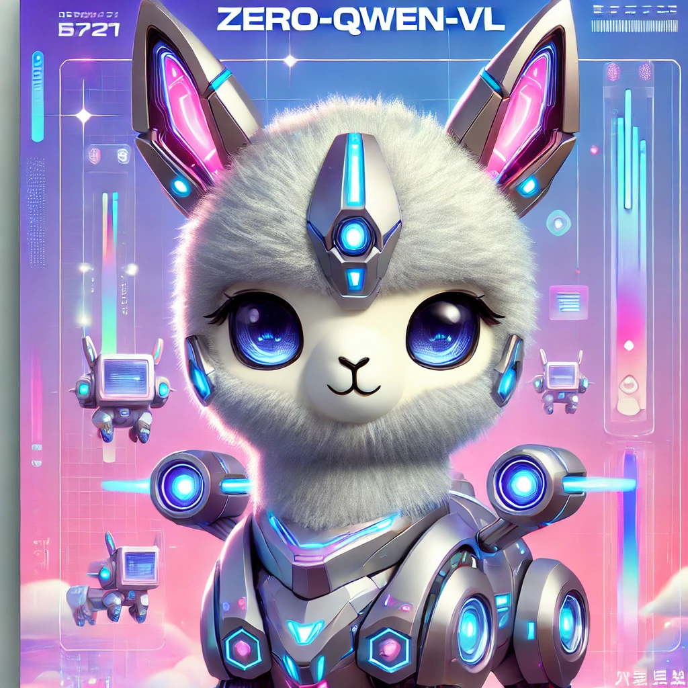
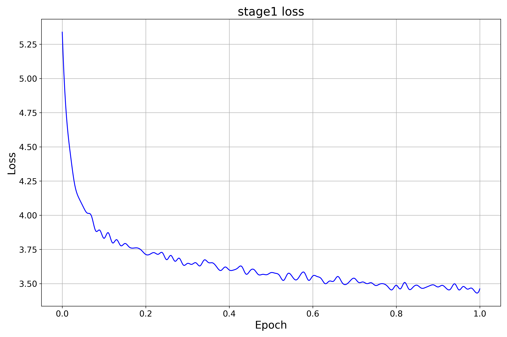
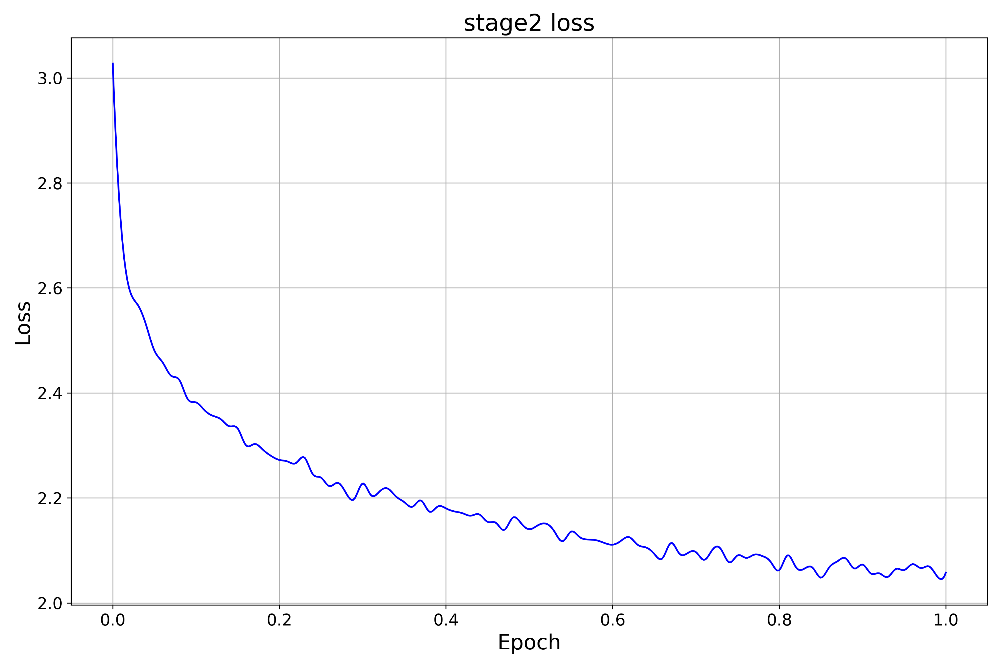
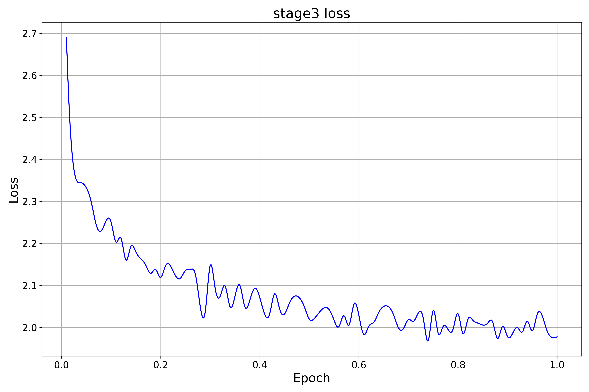

# Zero-Qwen-VL
<p align="center">
  
</p> 
从0开始训练一个对中文支持更友好的图文大模型，跑通图文多模态的训练流程。本项目用的是qwen-vl的图片编码器和Qwen2-0.5B-Instruct的语言模型，计算资源足够的话可以自己换成更大的模型，会有更好的效果。  

本来是想训练一个对中文支持更好的llava结构的模型，使用支持中文的语言模型、使用支持中文的图片编码器、使用中文的数据。千问系列我认为是目前开源做的很好的系列模型，并且支持中文，所以就想吧qwen-vl的图片编码器拿出来，结合qwen的语言模型，从零构建一个支持中文的图文模型。结果做完了才想到qwen-vl的图片编码器+qwen2，不就和qwen-vl差不多嘛，有点脱裤子放屁了。不过这里还是放出来了，流程大概是这样，后面又意愿的话也可以根据这个项目将其它模型的图片编码器和llm进行组合。

## 一、训练环境
conda create -n llava_pro python=3.12  
conda activate llava_pro  
pip install transformers -i https://pypi.tuna.tsinghua.edu.cn/simple  
pip install torch -i https://pypi.tuna.tsinghua.edu.cn/simple  
pip install torchvision Pillow -i https://pypi.tuna.tsinghua.edu.cn/simple  
pip install accelerate -i https://pypi.tuna.tsinghua.edu.cn/simple  
pip install datasetsclea  
pip install deepspeed -i https://pypi.tuna.tsinghua.edu.cn/simple  
pip install tensorboard  

## 二、训练数据和模型权重
训练分成3个阶段，只是数据和冻结的部分不同。stage1和stage2的数据用的是[Chinese-LLaVA-Vision-Instructions](https://huggingface.co/datasets/LinkSoul/Chinese-LLaVA-Vision-Instructions/tree/main)中的LLaVA-CC3M-Pretrain-595K和LLaVA-Instruct-150K。stage3是对TextOCR-GPT4o和ShareGPT-4o翻译后的数据，数据放在这里了：[Chinese_Llava_Data](https://huggingface.co/datasets/My521/Chinese_Llava_Data/tree/main)。  

三个阶段的模型权重在这里：[Zero-Qwen-VL](https://huggingface.co/My521/Zero-Qwen-VL)。  

要求训练数据的格式为


- `/data_path`
  - `images/`
    - `xxx.jpg`
    - `yyy.jpg`
    - `zzz.jpg`
  - `chat.json`  


chat.json格式为：

```json
[
    {
        "id": "GCC_train_000005572",
        "image": "GCC_train_000005572.jpg",
        "conversations": [
            {
                "from": "human",
                "value": "xxx\n<image>"
            },
            {
                "from": "gpt",
                "value": "yyy"
            }
        ]
    }
    ...
]  
```

## 三、图像和文本权重处理
需要下载Qwen-VL-Chat和Qwen2-0.5B-Instruct的模型权重，运行extract_weight.py将模型权重抽取到对应vision文件夹下面，并且整合Qwen-VL-Chat的视觉权重和Qwen2-0.5B-Instruct的权重到./llava_pro下面，后面直接从./llava_pro下面直接加载模型即可。  

**想要更好的效果可以换成更大的语言模型。**   

## 四、训练过程  
计算资源：2 * A40  

| 训练阶段        | 训练脚本        | 训练数据       | 训练参数       | 训练时间       | 学习率        |
|:---------------:|:---------------:|:--------------:|:--------------:|:--------------:|:-------------:|
| stage1   |  ./stage1.sh   |LLaVA-CC3M-Pretrain-595K-Chinese  | projection  | 5h  | 1e-3 |
| stage2   |  ./stage2.sh   |LLaVA-Instruct-150K-Chinese  | projection + llm  | 5.5h  | 2e-5 |
| stage3   |  ./stage3.sh   |TextOCR-GPT4o-Chinese + ShareGPT-4o-Chinese  | projection + llm  | 2h  | 2e-5 |  


<p align="center">
  
</p> 

<p align="center">
  
</p> 

<p align="center">
  
</p> 


## 五、效果测试  

<p align="center">
  
</p> 

| 训练阶段        | 问题       | 答案       |
|:---------------:|:--------------:|:--------------:|
| stage1   | 这个图片描述的是什么内容？  | 一个年轻的女人和她的狗在海滩上玩  |
| stage2   | 这个图片描述的是什么内容？  | 这个图片描绘了一个女人和她的狗在海滩上玩耍，女人在狗的爪子上  |
| stage3   | 这个图片描述的是什么内容？  | 图片描绘了一幅宁静的海滩场景，一位女士和一只狗坐在沙滩上。女士位于  |  


可能是因为stage3的训练数据只是简单的翻译，并没有清洗，数据质量不高的缘故，stage3后的模型效果感觉不如stage2。

测试的时候，直接将生成的模型权重替换掉原模型权重即可，或者将模型的.py文件和配置文件也放在模型权重的文件夹里面。模型权重更新后，运行test.py可以测试效果。  


## 参考链接
[Qwen-VL](https://github.com/QwenLM/Qwen-VL)  
[zero_nlp](https://github.com/yuanzhoulvpi2017/zero_nlp/tree/main)  